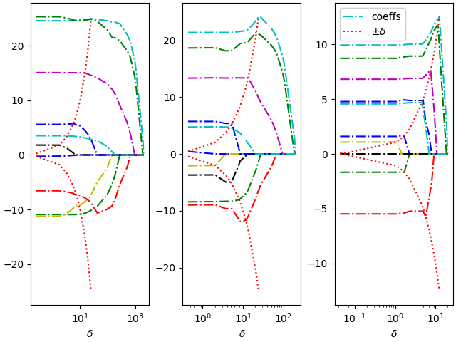

# l0l2
**Sparse Modeling via Biconjugate Convex Relaxation Solver Techniques**\
The solver addresses solutions for sparse linear least squares problems via $l_0$, $l_2$  combined regularizations.
```math
\min \left\|Ax-b\right\|^2_2 + \rho\left\|x\right\|_0 + \beta\left\|x\right\|^2_2,\;x\in\mathbb{R}^n.
```
$\rho \geq 0$ is a parameter that controls the sparsity of the solutions. With $\rho = \beta\delta^2$, we simply consider
```math
(\mathbb{P}^{\beta, \delta}) \min \left\|Ax-b\right\|^2_2 + \beta\delta^2\left\|x\right\|_0 + \beta\left\|x\right\|^2_2,\;x\in\mathbb{R}^n.
```
The considered Biconjugate Convex Relaxation is given by
```math
(\mathbb{Q}^{\beta, \delta}) \min \left\|Ax-b\right\|^2_2 + \beta\delta^2(\left\|.\right\|_0 + \frac{1}{\delta^2}\left\|.\right\|_2^2)^{**}(x),\;x\in\mathbb{R}^n.
```
Implemented solutions:
- Linear solver and full regularization path solver via Gauss-Jordan eliminations and the piecewise linearity of the solutions with respect to $\delta$.
- Cyclic Coordinate Descent solver.
- Interior Point Method solver. WIP



For the technical details see the technical report and references therein.

We use c++ 23 and later.

Dependencies:
- Eigen c++ library, https://libeigen.gitlab.io/
- thread-pool c++ libary, https://github.com/ptsouchlos/thread-pool
- pybind11 used for python interfaces, https://github.com/pybind/pybind11
- openMP

Builds: WIP
- windows with visual studio
- ubuntu

Benchmarks details: WIP
